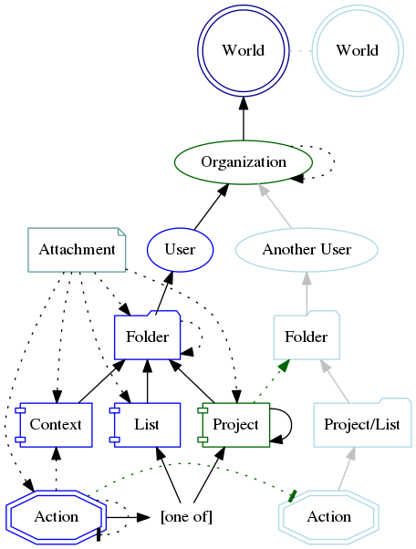
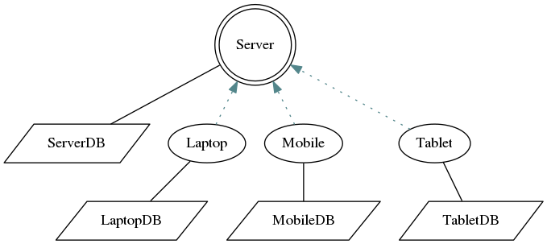

# VikingGTD

## Mission Statement

*To create the perfect "Getting Things Done" Software Suite*

## Background

I stumbled upon David Allens' brilliant book "Getting Things Done"
a few years ago. Like hundreds of thousands of busy people before me,
I realized that this "GTD" methodology may actually work. I tried it
in my own "lite" version, and it did in fact work. Then I make a simple
Android App (VikingGTD in Google Play) - and it radically changed my
productivity and almost removed stress from my life. No it's about
time to make the real thing!

There are already several good GTD applications available, but none
that 100% fills my needs. So this is what I want to accomplish here:
The "GTD" application of my dreams.

I sincerely hope that this will also become the GTD application of
*your* dreams, and I am therefore very open for your suggestions and
thoughts.

## Current State
The project is rebooted (again) as of September 2016.

## Planned features in 2016
 * The full "GTD" work-flow in a nice, rich PC and Mac application.
 * A companion Android App that can do the basic operations when you are on the move.
 * A Cloud Server that handles synchronization between devices and backup.
 

## Architecture
*This section is a bit technical, and primarily aimed at people with good
technical skills, like engineers and software developers.*

### Abstract relationship between objects
The following diagram is a draft for the relationship between objects.
A *World* in this context is a single instance of a back-end (Cloud) server
(with or without Fault Tolerance). As you can see, the architecture
has the concept of *Organizations*, and *Users* (individuals). These
individuals organize their *Contexts*, *Lists* and *Projects* in *Folders*.

 - **Folder** - Just a place where you put other folders or Projects, Lists or Contexts.
 - **Project** - Any "Stuff" that require more than one Action to be completed. A project and it's actions can be shared among users.
 - **List** - Visualize a paper-sheet with some stand-alone scribbled *Actions* on it.
 - **Context** - A user-defined query (for example "In the Car", or "In the Office - when I have a good focus" where actions show up. It looks like a List, but one Action can appear in many Contexts.
 - **Attachment** - A Note, a Picture, a Scanned Document, an Email, a Word Document, a Web Page - an Url or pretty much anything (like your Email attachments or DropBox files).

### Location of Data

This diagram shows where the data is located.

Each device have it's own database. There is no need for Internet access in order
to use any of the devices. Internet access is only required when you want to synchronize
the local data with the Server. Normally, this will happen in the background when
Internet is available - if you have linked the device with a server. If you use
only one device (laptop, tablet or phone) - and you don't need or want a "Cloud Backup" - the
application will work perfectly fine alone.

### Design Goals
 - The Client Application should work well as a stand-alone application.
 - Good integration with other popular applications.
 - Client platforms: Linux, Windows, OS/X.
 - Mobile Platforms: Android, iOS.
 - Server Platforms: Linux, BSD
 - Use as few dependencies as possible.
 - Modern, efficient code (C++14)
 - Open APIs for other projects (server API based on gRPC, Android Intents)
 - Use very little power on mobile devices.
 - Distributed data architecture – Easy to switch between devices and just continue to work.
 - Frictionless work-flow and user interfaces.
 - Instant GUI response (max 100ms interactive response, max 1 Second to update UI). Do slow things in worker-threads.
 - Security and Privacy. Correctly implemented TLS over the wire. Strong Emphasis on access-control inside the application layers.
 - Allow and encourage in-house Server deployments.
 - No Bugs, No Regressions (use unit tests and functional tests to validate all functionality).
 - Integrate with other systems trough standards whenever possible (WebDAV, CalDAV).
 - Make the application easy to translate into new languages.
 - Allow users to collaborate with Projects and to delegate Actions to others.
 
## License
VikingGTD is released under GPLv3. It is Free. Free as in Free Beer. Free as in Free Air.

No *In App* advertising. No collecting data. When you use VikingGTD - your privacy is
respected. You are the valued consumer of the product. You yourself is not,
and will never be, the product. That is how *real*, *Free* Software works.
